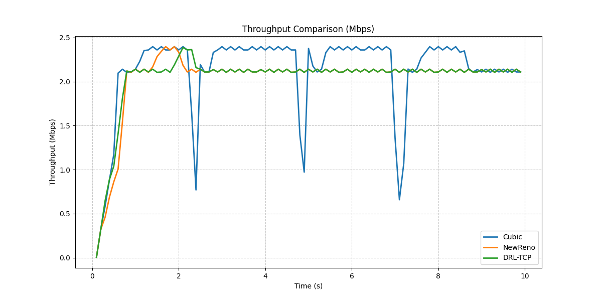
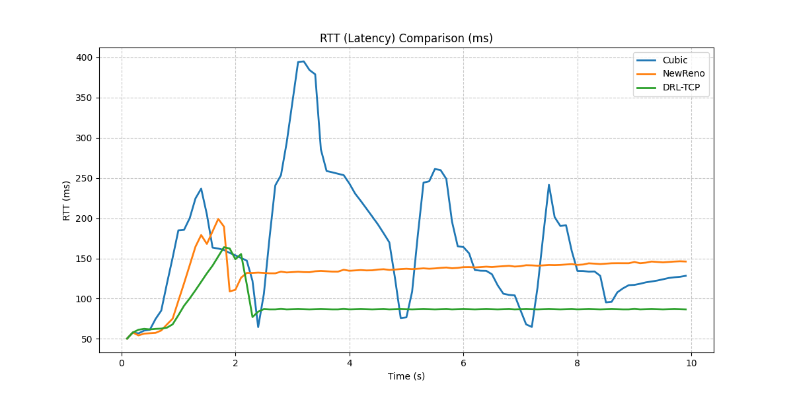
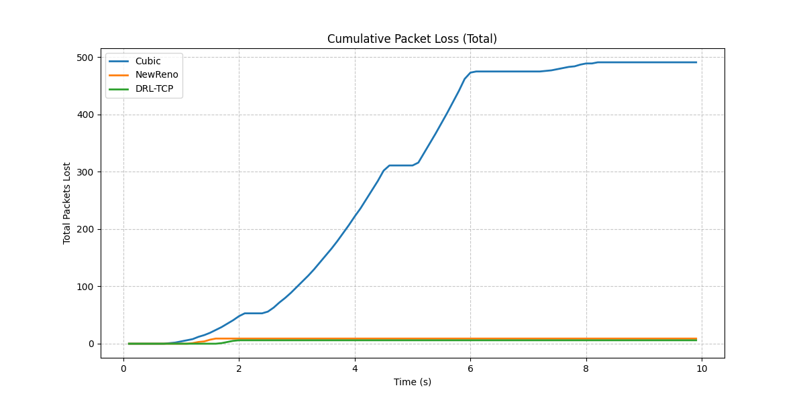

# 🧠 Deep Reinforcement Learning based TCP Congestion Control

[](https://arxiv.org/abs/2508.01047)
[](https://paperswithcode.com/paper/deep-reinforcement-learning-based-tcp)


> **Official Implementation** of the paper: [**Deep Reinforcement Learning based TCP Congestion Control**](https://arxiv.org/abs/2508.01047)

This repository contains the implementation of a **Deep Q-Network (DQN)** based TCP congestion control algorithm. The project utilizes the **NS-3 Network Simulator** coupled with **OpenAI Gym** via the `ns3-gym` interface to train an intelligent agent capable of managing network congestion dynamically.

The primary goal of this research is to optimize the **Throughput-Delay Trade-off**, addressing the "Bufferbloat" problem common in traditional algorithms like TCP Cubic.

---

## 🏆 Key Research Findings

Unlike rule-based heuristics (Cubic, NewReno), our DRL agent uses a hybrid reward function to dynamically adapt the Congestion Window (cWnd). The model was evaluated using a strict **"Train-then-Test"** protocol ($\epsilon=0$).

### 1. Significant Latency Reduction
Compared to TCP Cubic, the DRL agent achieved a **46.29% reduction in Round-Trip Time (RTT)** while maintaining comparable throughput levels.

### 2. Near-Zero Packet Loss
While TCP Cubic caused significant buffer overflows (~500 packet drops) due to its aggressive growth, the DRL agent learned the network capacity limit and maintained **near-zero packet loss**, effectively mitigating bufferbloat.

### 3. Stability
The agent eliminates the aggressive "sawtooth" pattern observed in standard TCP variants, providing a smoother data transmission rate.

---

## 🛠 Technical Approach

* **Algorithm:** Deep Q-Network (DQN) with Experience Replay.
* **Action Space (Discrete):**
    1.  **Maintain:** Keep cWnd constant.
    2.  **Standard Increase (+1500):** Steady growth.
    3.  **Conservative Decrease (-150):** Granular reduction to drain queue.
    4.  **Rocket Start (+4000):** Custom action for rapid bandwidth acquisition.
* **State Space:** BytesInFlight, cWnd, RTT, SegmentsAcked, ssThresh.
* **Reward Function:** Linear function with a tuned penalty for latency to discourage queue saturation.

---

## 📊 Visual Results

*(Graphs generated from NS-3 simulation traces)*

### 🔹 Throughput Comparison
The DRL agent (Green) successfully matches the bandwidth utilization of TCP Cubic (Blue) without aggressive overshooting.


### 🔹 RTT (Latency) Analysis
**Critical Result:** The DRL agent maintains a consistently low RTT, whereas Cubic causes high latency spikes due to buffer filling.


### 🔹 Cumulative Packet Loss
The DRL agent demonstrates superior reliability with almost zero packet loss compared to Cubic.


---

## ⚙️ Prerequisites

To run this simulation, you need a working environment with:

* **Linux OS** (Ubuntu 20.04/22.04 or WSL2)
* **NS-3 Simulator** (Version 3.35 recommended)
* **NS-3 OpenGym Module** ([Installation Guide](https://github.com/tkn-tub/ns3-gym))
* **Python Dependencies:**
    ```bash
    pip install tensorflow pandas matplotlib scipy
    ```

---

## 🚀 Usage Guide

Since NS-3 OpenGym works with two separate processes (Python Agent & C++ Simulation), follow these steps:

1.  **Locate the Files:**
    * Identify the Python script (Agent) in this repo.
    * Identify the C++ simulation script (`.cc`).

2.  **Setup NS-3:**
    * Copy the `.cc` file to your NS-3 `scratch/` folder (or `contrib/opengym/examples/`).

3.  **Run the Python Agent (Terminal 1):**
    ```bash
    python3 TCP-RL-Agent.py
    # The script will wait for the NS-3 connection...
    ```

4.  **Run the Simulation (Terminal 2):**
    ```bash
    cd /path/to/ns-3-folder/
    ./waf --run "scratch/your-simulation-file"
    ```

---

## 📄 Citation

If you use this code or our findings in your research, please cite our paper:

```bibtex
@article{aglamazlar2025tcpdrl,
  title={Deep Reinforcement Learning based TCP Congestion Control},
  author={Ağlamazlar, Efe and Eken, Emirhan and Geçici, Harun Batur},
  journal={arXiv preprint arXiv:2508.01047},
  year={2025},
  url={[https://arxiv.org/abs/2508.01047](https://arxiv.org/abs/2508.01047)}
}
```

🤝 Contributors
Efe Ağlamazlar - Lead Developer & AI Implementation
Emirhan Eken - Network Simulation & Analysis
Harun Batur Geçici - Research & Documentation
<p align="center">
<sub>This project is a research implementation for educational purposes.</sub>
</p>
